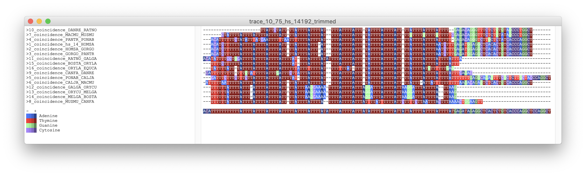

# sequenceVisor

[](https://forthebadge.com)

**sequenceVisor** is a basic TkInter based interface to visualize DNA sequence allignments from `.fasta` files, along with an approximate saturation of each of them, and a consensus sequence. Here is an example of an output with a clear allignment between different species.



## Installation

1. Install Python (any current version will do, since they come with TkInter pre-installed).
2. Install the `pandas` module.
3. Clone the repository into your locale. 

## Usage

To use **sequenceVisor**, it should be noted that your `.fasta` file must have the following format:

```
>Header
<sequences>
>Header
<sequence>
...
```

If in that format, just go into the script's directory and type in the following:

`python sequence_visualizer.py <fasta_file> <display_mode> <font_size>`

There are currently 4 different display modes, which you can check by just running the program without additional arguments.

`python sequence_visualizer.py`

## Authors

* Diego Linares - Grupo BITLAB 

Estancia en la **Universidad de Málaga** (UMA)